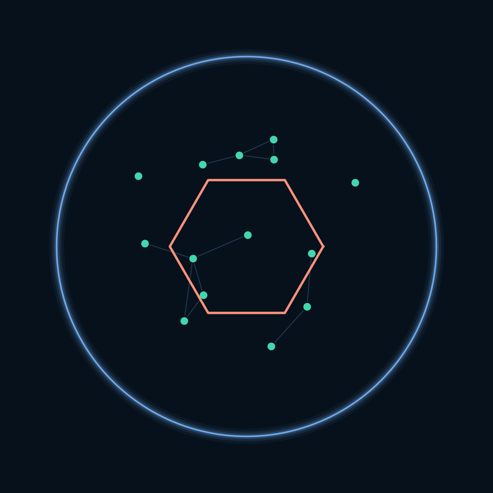
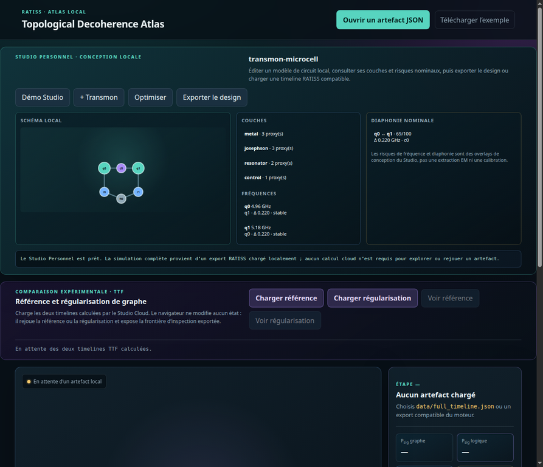
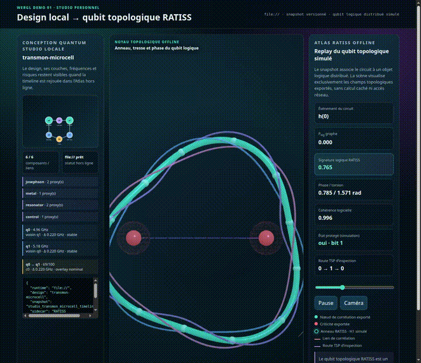
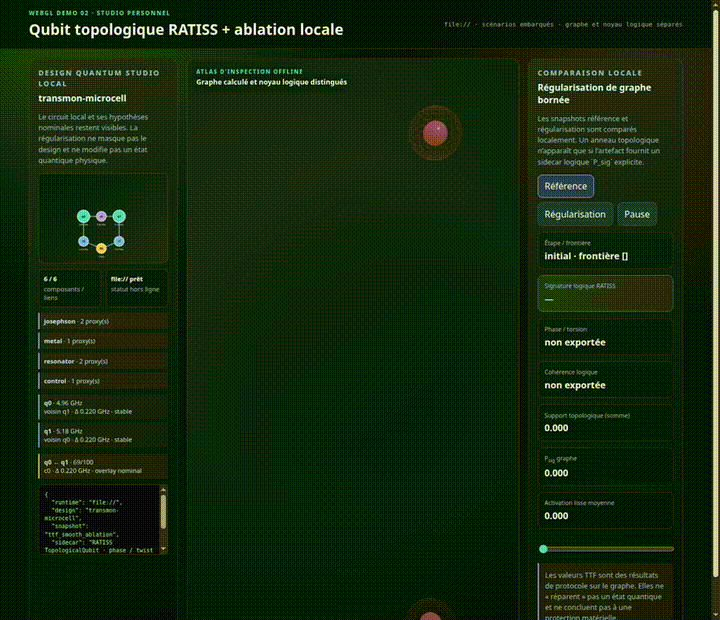
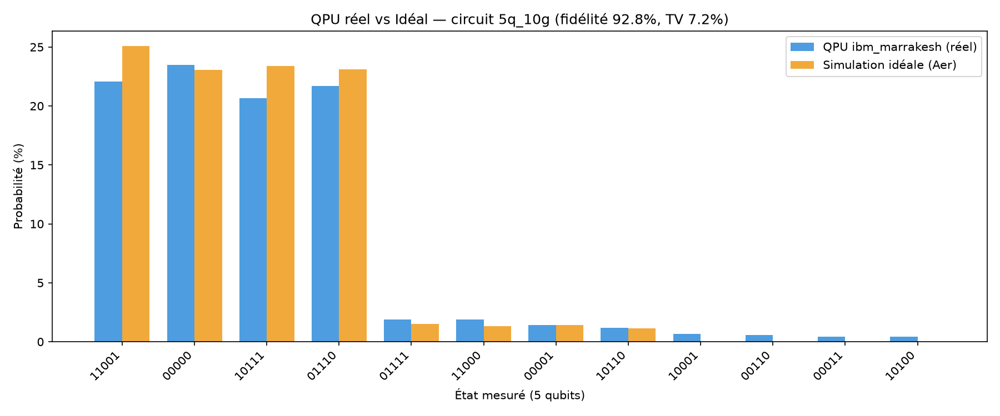
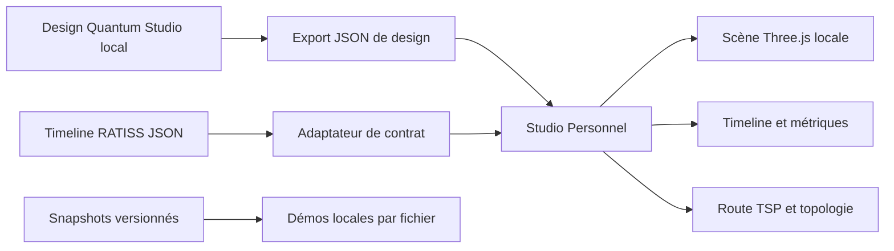

<p align="center">
  
</p>

[](https://github.com/jonathansearch)

<p align="center">
  
</p>

<h1 align="center">RATISS Quantum Topology Studio Personal</h1>

<p align="center">
  <a href="LICENSE"></a>
  
  
  
</p>

> **Un studio de conception et de cartographie topologique qui s’ouvre directement dans le navigateur, sans serveur, sans CDN et sans compte.**

Le **Studio Personnel** est le compagnon hors ligne du Studio Cloud. Il met dans un seul dépôt une conception locale compacte issue du modèle Quantum Circuit Studio, un lecteur de timelines RATISS, une scène WebGL Three.js empaquetée localement, les métriques exportées, les routes TSP et une comparaison d’ablation TTF. Il est conçu pour être cloné, ouvert et exploré seul.



> **Preuve visuelle de l’interface hors ligne.** Cette capture réelle montre le design `transmon-microcell`, son schéma local, les couches, les fréquences, l’overlay de diaphonie, les contrôles d’export et les panneaux d’atlas dans la page `file://`. Le Studio Personnel présente et exporte les données ; il ne prétend pas simuler une matrice densité ou valider un matériel dans le navigateur.

## Pourquoi un qubit topologique RATISS dans un Studio Personnel ?

Le Studio Personnel n’est pas une version décorative ou affaiblie du paradigme RATISS. Il conserve, dans un navigateur ouvert par `file://`, la capacité de **rejouer un qubit topologique logique simulé** à partir des champs réellement présents dans une timeline. Cette séparation est volontaire : le calcul dense et la production de l’artefact peuvent avoir lieu dans le Studio Cloud, alors que l’examen de la phase, de la torsion, de la cohérence et de la signature logique reste local, portable et sans réseau.

> Lorsque `logical_topology` est exporté, l’Atlas dessine un anneau distribué, trois brins de tresse et un arc de phase qui correspondent aux champs du snapshot. Lorsqu’il est absent — par exemple dans une ablation TTF de graphe — le lecteur affiche **« non exportée »** et ne fabrique aucun qubit topologique visuel.

| Besoin scientifique | Réponse du Studio Personnel | Limite préservée |
|---|---|---|
| Relire une trajectoire de circuit en dehors de la machine de calcul | Chargement d’un `timeline.v1` ou d’un snapshot embarqué, avec design et provenance visibles. | Le navigateur ne relance pas une simulation matrice densité (il lit les artefacts, simulés ou mesurés sur QPU). |
| Comprendre la couche topologique logique | Anneau, tresse, phase, cohérence et protection affichés depuis l’artefact. | Ce sont des variables logicielles, pas des mesures d’un qubit matériel. |
| Préparer une revue ou une discussion scientifique | La scène relie design, relations de graphe, criticité et signature logique à une étape précise. | La scène audite les artefacts fournis. Ce que la scène ne fait pas : prouver une correction d’erreur physique ou contrôler le matériel. |
| Comparer les scénarios TTF | La bascule conserve la provenance de référence/régularisation et déclare l’absence éventuelle de sidecar logique. | L’ablation reste une expérience sur les relations de graphe. |

### La grammaire visuelle locale

La scène Three.js ne simule pas d’atomes ni ne crée de données supplémentaires. L’anneau tordu et ses douze balises dérivent de `twist` et `P_sig`; l’arc doré suit `phase`; la luminosité suit `coherence`; l’état vert/rouge suit `protected`. Les solides et les tubes voisins relèvent du graphe de corrélations exporté ; la route rose est un ordre TSP d’inspection séparé. Cette distinction rend la page portable sans transformer un replay visuel en affirmation matérielle.

## Une expérience complète, hors ligne

Le navigateur ne doit pas deviner une simulation. Il affiche les résultats exacts d’un artefact JSON ou d’un snapshot généré depuis ce fichier. Cela donne une frontière claire entre **conception locale**, **replay visuel** et **calcul du moteur**.

| Fonction | Disponible sans connexion | Source de vérité |
|---|---:|---|
| Design `transmon-microcell` compact | Oui | `studio-model.js` |
| Couches conceptuelles et fréquences nominales | Oui | Modèle de conception local |
| Overlay de diaphonie | Oui | Heuristique de conception explicitement étiquetée |
| Export de design | Oui | Format `quantum-circuit-studio/v0.1` |
| Lecture de timeline RATISS | Oui | Fichier `timeline.v1` choisi localement |
| Scène WebGL, nœuds, tubes et route TSP | Oui | Champs exportés de la timeline |
| Comparaison TTF | Oui | Deux timelines TTF séparées ou snapshots embarqués |
| Matrice densité ou soumission QPU | Non | À exécuter dans le Studio Cloud |

## Interface complète, vraiment hors ligne

Le Studio Personnel ne réduit pas le modèle Quantum Studio à un simple lecteur. Il conserve un espace de conception compact pour afficher le schéma, les composants, les couches conceptuelles, les fréquences et la diaphonie nominale, puis associe ce design à un atlas WebGL lorsque l’utilisateur ouvre une timeline compatible. Les scripts classiques et Three.js distribués dans le dépôt permettent cette expérience avec `file://`, sans CDN et sans dépendance réseau.

| Zone visible dans l’interface | Fonction locale | Portée explicitement limitée |
|---|---|---|
| Conception Quantum Studio | Démo, ajout de transmon, optimisation heuristique et export `v0.1` | Pas de layout de fonderie ni extraction EM |
| Schéma, couches et fréquence | Inspection d’un design local et de ses proxys | Fréquences nominales, non calibrées |
| Overlay de diaphonie | Risque de conception selon une heuristique documentée | Pas une mesure électromagnétique |
| Atlas WebGL et timeline | Replay d’un artefact fourni par fichier ou snapshot | N’invente aucune donnée ou métrique absente |
| Comparaison TTF | Bascule entre deux timelines calculées séparément | Ablation de graphe, pas correction matérielle |

## Lancement immédiat

```bash
git clone https://github.com/evinajonathan13-max/ratiss-decoherence-atlas
cd ratiss-decoherence-atlas
# Ouvrir index.html directement dans Chrome, Firefox ou Safari.
```

La page principale fournit un design local prêt à lire. Pour rejouer un calcul, cliquez **« Ouvrir un artefact JSON »** puis sélectionnez `data/full_timeline.json`, une timeline du Studio Cloud, ou un fichier compatible. Ce flux volontaire contourne les restrictions de `fetch()` associées à `file://` sans introduire de serveur caché.

## Démonstrations WebGL visibles directement dans ce README

GitHub Markdown ne peut pas exécuter le JavaScript de pages `file://` dans un README. Les deux blocs suivants apportent donc des **aperçus animés réels**, issus des rendus du Studio Personnel en fonctionnement hors ligne. Un clic ouvre la vidéo WebM versionnée ; pour manipuler la scène, ouvrez simplement le fichier HTML local indiqué.

### Démonstration 01 — replay local design + trajectoire

[](docs/media/personal-trajectory-webgl.webm)

L’aperçu présente deux étapes de la timeline locale, de `h(0)` à `cz(0,1)`, sans cacher le design Studio à gauche. La démo interactive enrichie rend visible l’anneau, les trois brins de tresse et la phase du qubit topologique logique lorsque ces champs sont réellement exportés. Elle reste entièrement `file://`, sans appel réseau. Pour l’interaction complète, ouvrez [`demos/trajectory-replay.html`](demos/trajectory-replay.html) depuis le clone local.

### Démonstration 02 — ablation TTF locale

[](docs/media/personal-ttf-webgl.webm)

L’aperçu alterne la référence et la régularisation embarquées tout en conservant l’interface Quantum Studio et la provenance `file://`. La comparaison agit sur les relations de graphe exportées ; elle ne modifie pas un état quantique physique. Pour l’interaction complète, ouvrez [`demos/ttf-ablation.html`](demos/ttf-ablation.html) depuis le clone local.

| Démonstration | Média intégré | Vidéo | Interaction locale |
|---|---|---|---|
| Replay local de trajectoire | [`GIF animé`](docs/media/personal-trajectory-webgl-preview.gif) | [`WebM`](docs/media/personal-trajectory-webgl.webm) | Timeline, rotation, zoom et reset caméra |
| Comparaison locale TTF | [`GIF animé`](docs/media/personal-ttf-webgl-preview.gif) | [`WebM`](docs/media/personal-ttf-webgl.webm) | Référence/régularisation, timeline, rotation et zoom |

Les captures sont des rendus réels des deux pages, et non des maquettes. Le catalogue, la recette de régénération et les constats visuels sont disponibles dans [`docs/DEMO_CATALOG.md`](docs/DEMO_CATALOG.md) et [`docs/DEMO_VISUAL_AUDIT.md`](docs/DEMO_VISUAL_AUDIT.md).

## Lire la scène sans surinterpréter les couleurs

| Élément affiché | Signification dans le lecteur | Ce que cela ne veut pas dire |
|---|---|---|
| Sphère turquoise | Nœud avec support de graphe exporté | Qubit physiquement stable |
| Sphère rouge | Nœud dépassant le seuil de criticité de l’artefact | Défaut matériel diagnostiqué |
| Tube bleu-violet | Relation ou arête exportée | Couplage électromagnétique mesuré |
| Chemin rose | Route TSP d’inspection | Calcul de `P_sig` ou correction d’erreur |
| Ligne `P_sig` | Persistance de graphe fournie | Signature du noyau logique, sauf champ dédié |
| Signature logique | Sortie du noyau RATISS simulé, lorsqu’elle existe | Mesure directe d’un qubit topologique matériel |


## Validation sur QPU réel (IBM Quantum) — exécutée sur ibm_marrakesh

Notre simulateur n'est **pas que théorique** : deux circuits ont été exécutés
sur un vrai QPU **ibm_marrakesh** (IBM Quantum), et les résultats mesurés
alimentent les artefacts que cet Atlas rejoue. Les Job IDs sont publics et
vérifiables sur [quantum.ibm.com](https://quantum.ibm.com).



### Exemple 1 — Bell state (2 qubits) : `da53s4jotlns739bfgu0`

Circuit `h(0); cx(0,1); measure_all`, 1024 shots.

| Métrique | Résultat |
|---|---|
| Counts mesurés | `{'11': 526, '00': 491, '01': 4, '10': 3}` |
| États attendus | **98.7%** (|00⟩ + |11⟩) |
| Transformation | engine → timeline.v1 |

### Exemple 2 — circuit framework 5 qubits × 10 portes : `da58ftmaa69c739kic90`

Circuit identique au scénario du moteur (h, cx, cx, h, cx, cx, cz, ry, rz, cx),
2048 shots.

**QPU réel vs simulation idéale (même circuit) :**

| Métrique | Valeur mesurée |
|---|---:|
| Fidélité classique (recouvrement) | **0.928** |
| Distance total-variation | **0.0718** |
| États attendus (4 principaux) | **87.9%** des shots |
| **Taux de décohérence réelle** | **12.1%** (27 états parasites) |
| Top état QPU | `11001` — 22.1% (vs 25.1% idéal) |

### Portée honnête

- Ce sont des **exécutions QPU réelles**, pas des simulations. Job IDs publics.
- On compare des distributions de mesures classiques (pas une tomographie).
- L'Atlas rejoue les artefacts produits par le moteur — la validation
  matérielle vient de l'engine, pas de cette interface.

Artefacts réutilisés (produits par l'engine) : `qpu_bell_counts.json`,
`qpu_5q_counts.json`, `qpu_5q_timeline.json`, `qpu_vs_ideal_comparison.json`.

---
## Contrats compatibles

Le lecteur comprend le format principal `ratiss.topological-decoherence.timeline.v1`, le modèle `quantum-circuit-studio/v0.1` et, pour compatibilité, le format historique RATISS contenant `timeline`, `states`, `graphs` et `n_qubits`. Les imports historiques sont marqués comme tels : aucun score absent n’est reconstruit pour embellir la scène.

| Type de timeline | Contenu lisible | Étiquetage de portée |
|---|---|---|
| Simulation densité | Relations, topologie, fidélité, pureté et criticité si exportées | Simulation locale par défaut. Le pipeline audite aussi les mesures QPU (comptages) — voir section Validation. |
| Statevector | Relations dérivées et provenance | Statevector de simulation, pas matériel |
| Comptages Qiskit | Associations classiques de bits | Pas de tomographie, ni entanglement inféré |
| Modes photoniques | Co-occupations déclarées | Pas de matrice densité photonique inférée |
| Corrélations bio | Matrices et structures déclarées | Pas de diagnostic biologique automatique |
| Ablation TTF | Référence/régularisation de graphe | Pas de correction d’erreur physique |

## Architecture locale



Le fichier `vendor/three.min.js` est fourni dans le dépôt. Aucune dépendance n’est chargée via CDN au runtime. Les scripts classiques `studio-model.js` et `personal-studio.js` existent précisément pour conserver le fonctionnement `file://` dans les navigateurs qui bloquent les imports ES module locaux.

## Utiliser les données du Studio Cloud

Le Studio Cloud produit la timeline complète, puis le Studio Personnel peut la relire sans dépendance de runtime. Le flux est volontairement simple :

```text
Concevoir ou exporter un design local
        ↓
Simuler dans le Studio Cloud si nécessaire
        ↓
Copier ou partager la timeline JSON
        ↓
L’ouvrir dans le Studio Personnel hors ligne
        ↓
Rejouer, inspecter et présenter la scène WebGL
```

Le contrat entre les deux produits est détaillé dans le dépôt Cloud et résumé dans [`docs/VERIFICATION_NOTES.md`](docs/VERIFICATION_NOTES.md). L’index de chaque preuve de lecture est disponible dans [`docs/EVIDENCE_INDEX.md`](docs/EVIDENCE_INDEX.md).

## Vérification et régénération des démos

```bash
pnpm test
node scripts/build_demo_snapshots.mjs
node --check demos/scene-demo.js
```

| Commande | Vérifie ou produit |
|---|---|
| `pnpm test` | Artefact de base, modèle Studio et trois fixtures externes |
| `node scripts/build_demo_snapshots.mjs` | Snapshots des deux démos à partir des JSON versionnés |
| `node --check demos/scene-demo.js` | Syntaxe du renderer WebGL de démonstration |
| Ouvrir les deux fichiers HTML | Compatibilité réelle avec `file://` |

## Limites de portée

Le Studio Personnel ne lance pas une simulation matrice densité, ne soumet pas de circuit, n’effectue pas une extraction EM et ne constitue pas une validation de matériel. Il prépare, exporte et visualise un design ainsi que les résultats explicitement fournis par un artefact.

## Licence

Ce dépôt est distribué sous [licence MIT](LICENSE). Les métadonnées de citation sont dans [`CITATION.cff`](CITATION.cff). Le modèle Quantum Circuit Studio réutilisé et les données de démonstration gardent leur provenance documentée ; la licence ne remplace pas les limites de simulation de la documentation.
