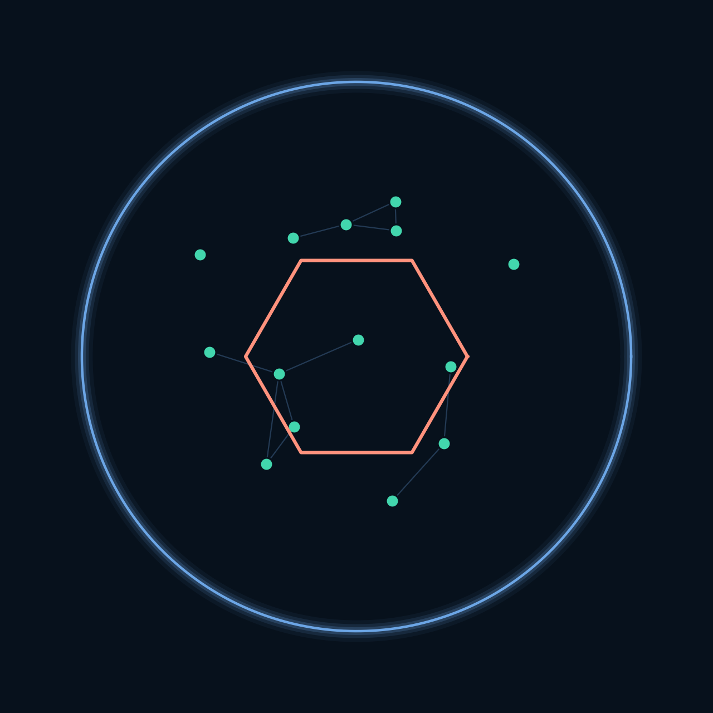
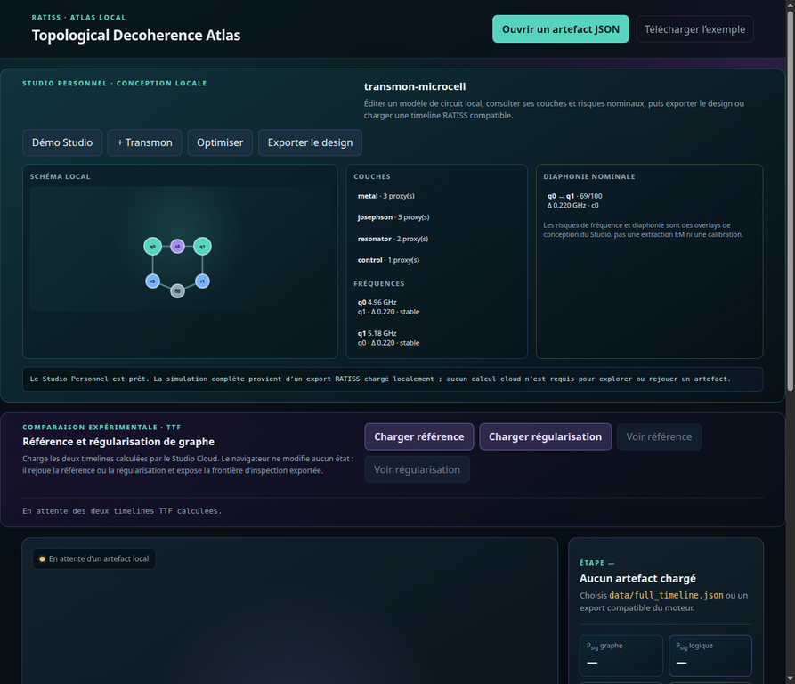
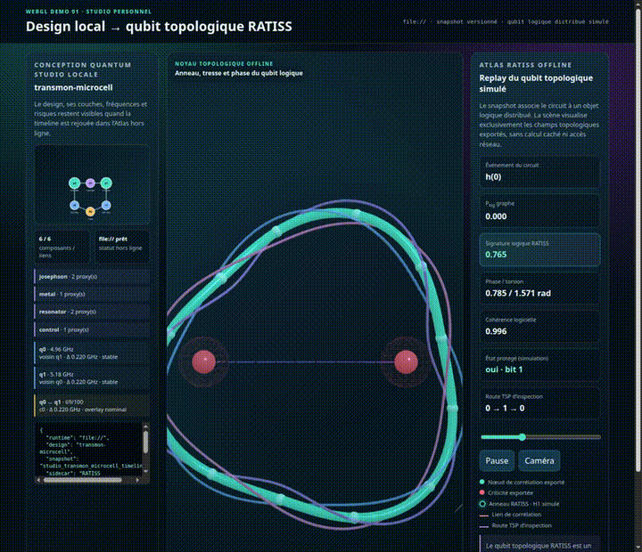
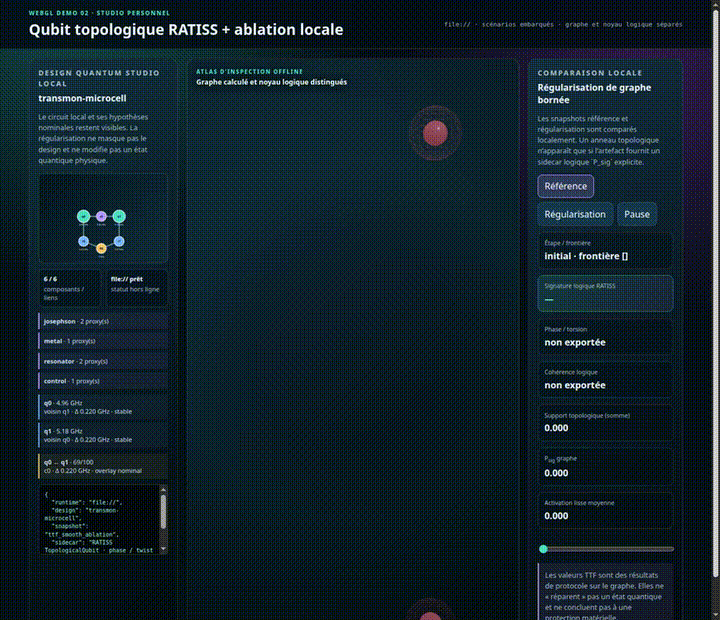
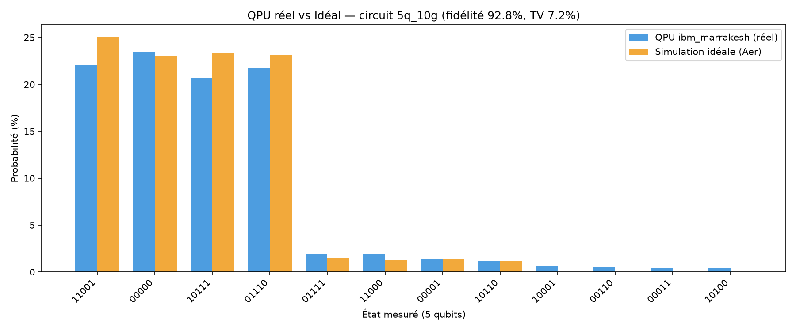
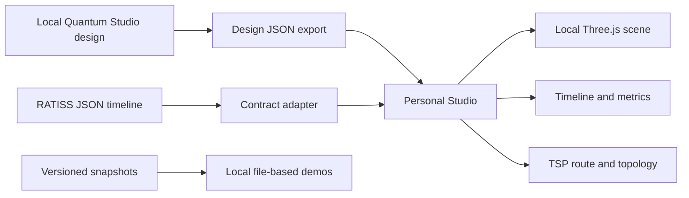

<p align="center">
  
</p>

[](https://github.com/jonathansearch)

<p align="center">
  
</p>

<h1 align="center">RATISS Quantum Topology Studio Personal</h1>

<p align="center">
  <a href="LICENSE"></a>
  
  
  
</p>

> **A topological design and mapping studio that opens directly in the browser — no server, no CDN, no account.**

The **Personal Studio** is the offline companion of the Studio Cloud. It packs into a single repository a compact local design derived from the Quantum Circuit Studio model, a RATISS timeline player, a locally bundled Three.js WebGL scene, the exported metrics, TSP routes, and a TTF ablation comparison. It is designed to be cloned, opened, and explored on its own.



> **Visual proof of the offline interface.** This real screenshot shows the `transmon-microcell` design, its local schematic, the layers, the frequencies, the crosstalk overlay, the export controls, and the atlas panels on the `file://` page. The Personal Studio presents and exports data; it does not claim to simulate a density matrix or validate hardware in the browser.

## Why a RATISS topological qubit in a Personal Studio?

The Personal Studio is not a decorative or weakened version of the RATISS paradigm. In a browser opened via `file://`, it retains the ability to **replay a simulated logical topological qubit** from the fields actually present in a timeline. This separation is deliberate: dense computation and artifact production can happen in the Studio Cloud, while the examination of phase, twist, coherence, and the logical signature stays local, portable, and network-free.

> When `logical_topology` is exported, the Atlas draws a distributed ring, three braid strands, and a phase arc that match the snapshot fields. When it is absent — for example in a graph TTF ablation — the player displays **"not exported"** and fabricates no visual topological qubit.

| Scientific need | Personal Studio answer | Preserved limit |
|---|---|---|
| Re-reading a circuit trajectory outside the compute machine | Loading a `timeline.v1` or an embedded snapshot, with visible design and provenance. | The browser does not re-run a density-matrix simulation (it reads artifacts, simulated or measured on QPU). |
| Understanding the logical topological layer | Ring, braid, phase, coherence, and protection displayed from the artifact. | These are software variables, not measurements of a hardware qubit. |
| Preparing a review or a scientific discussion | The scene links design, graph relations, criticality, and the logical signature to a precise step. | The scene audits the provided artifacts. What the scene does not do: prove physical error correction or control hardware. |
| Comparing TTF scenarios | The toggle keeps the reference/regularization provenance and declares any missing logical sidecar. | The ablation remains an experiment on graph relations. |

### The local visual grammar

The Three.js scene does not simulate atoms and does not create extra data. The twisted ring and its twelve beacons derive from `twist` and `P_sig`; the golden arc follows `phase`; brightness follows `coherence`; the green/red state follows `protected`. The neighboring solids and tubes come from the exported correlation graph; the pink route is a separate inspection TSP order. This distinction keeps the page portable without turning a visual replay into a hardware claim.

## A complete, offline experience

The browser must not guess a simulation. It displays the exact results of a JSON artifact or of a snapshot generated from that file. This draws a clear boundary between **local design**, **visual replay**, and **engine computation**.

| Feature | Available without connection | Source of truth |
|---|---:|---|
| Compact `transmon-microcell` design | Yes | `studio-model.js` |
| Conceptual layers and nominal frequencies | Yes | Local design model |
| Crosstalk overlay | Yes | Explicitly labeled design heuristic |
| Design export | Yes | `quantum-circuit-studio/v0.1` format |
| RATISS timeline playback | Yes | Locally chosen `timeline.v1` file |
| WebGL scene, nodes, tubes, and TSP route | Yes | Exported timeline fields |
| TTF comparison | Yes | Two separate TTF timelines or embedded snapshots |
| Density matrix or QPU submission | No | To be run in the Studio Cloud |

## A complete interface, truly offline

The Personal Studio does not reduce the Quantum Studio model to a mere player. It keeps a compact design space to display the schematic, the components, the conceptual layers, the frequencies, and the nominal crosstalk, then pairs that design with a WebGL atlas when the user opens a compatible timeline. The classic scripts and Three.js shipped in the repository enable this experience with `file://`, no CDN and no network dependency.

| Visible zone in the interface | Local function | Explicitly limited scope |
|---|---|---|
| Quantum Studio design | Demo, transmon addition, heuristic optimization, and `v0.1` export | No foundry layout or EM extraction |
| Schematic, layers, and frequency | Inspection of a local design and its proxies | Nominal frequencies, not calibrated |
| Crosstalk overlay | Design risk according to a documented heuristic | Not an electromagnetic measurement |
| WebGL atlas and timeline | Replay of an artifact supplied by file or snapshot | Never invents missing data or metrics |
| TTF comparison | Toggle between two separately computed timelines | Graph ablation, not hardware correction |

## Instant launch

```bash
git clone https://github.com/evinajonathan13-max/ratiss-decoherence-atlas
cd ratiss-decoherence-atlas
# Open index.html directly in Chrome, Firefox, or Safari.
```

The main page provides a ready-to-read local design. To replay a computation, click **"Open a JSON artifact"** then select `data/full_timeline.json`, a Studio Cloud timeline, or a compatible file. This deliberate flow bypasses the `fetch()` restrictions associated with `file://` without introducing any hidden server.

## WebGL demos visible directly in this README

GitHub Markdown cannot run the JavaScript of `file://` pages in a README. The two blocks below therefore provide **real animated previews**, taken from the Personal Studio renders running offline. One click opens the versioned WebM video; to manipulate the scene, simply open the indicated local HTML file.

### Demo 01 — local design + trajectory replay

[](docs/media/personal-trajectory-webgl.webm)

The preview shows two steps of the local timeline, from `h(0)` to `cz(0,1)`, without hiding the Studio design on the left. The enriched interactive demo makes the ring, the three braid strands, and the phase of the logical topological qubit visible when those fields are actually exported. It remains fully `file://`, with no network call. For full interaction, open [`demos/trajectory-replay.html`](demos/trajectory-replay.html) from the local clone.

### Demo 02 — local TTF ablation

[](docs/media/personal-ttf-webgl.webm)

The preview alternates the embedded reference and regularization while keeping the Quantum Studio interface and the `file://` provenance. The comparison acts on the exported graph relations; it does not modify a physical quantum state. For full interaction, open [`demos/ttf-ablation.html`](demos/ttf-ablation.html) from the local clone.

| Demo | Embedded media | Video | Local interaction |
|---|---|---|---|
| Local trajectory replay | [`Animated GIF`](docs/media/personal-trajectory-webgl-preview.gif) | [`WebM`](docs/media/personal-trajectory-webgl.webm) | Timeline, rotation, zoom, and camera reset |
| Local TTF comparison | [`Animated GIF`](docs/media/personal-ttf-webgl-preview.gif) | [`WebM`](docs/media/personal-ttf-webgl.webm) | Reference/regularization, timeline, rotation, and zoom |

The screenshots are real renders of the two pages, not mockups. The catalog, the regeneration recipe, and the visual findings are available in [`docs/DEMO_CATALOG.md`](docs/DEMO_CATALOG.md) and [`docs/DEMO_VISUAL_AUDIT.md`](docs/DEMO_VISUAL_AUDIT.md).

## Reading the scene without over-interpreting the colors

| Displayed element | Meaning in the player | What it does not mean |
|---|---|---|
| Turquoise sphere | Node with exported graph support | Physically stable qubit |
| Red sphere | Node exceeding the artifact criticality threshold | Diagnosed hardware defect |
| Blue-violet tube | Exported relation or edge | Measured electromagnetic coupling |
| Pink path | Inspection TSP route | `P_sig` computation or error correction |
| `P_sig` line | Provided graph persistence | Logical core signature, unless a dedicated field exists |
| Logical signature | Output of the simulated RATISS core, when it exists | Direct measurement of a hardware topological qubit |


## Validation on a real QPU (IBM Quantum) — run on ibm_marrakesh

Our simulator is **not just theoretical**: two circuits were run
on a real **ibm_marrakesh** QPU (IBM Quantum), and the measured results
feed the artifacts this Atlas replays. The Job IDs are public and
verifiable on [quantum.ibm.com](https://quantum.ibm.com).



### Example 1 — Bell state (2 qubits): `da53s4jotlns739bfgu0`

Circuit `h(0); cx(0,1); measure_all`, 1024 shots.

| Metric | Result |
|---|---|
| Measured counts | `{'11': 526, '00': 491, '01': 4, '10': 3}` |
| Expected states | **98.7%** (|00⟩ + |11⟩) |
| Transformation | engine → timeline.v1 |

### Example 2 — 5-qubit × 10-gate framework circuit: `da58ftmaa69c739kic90`

Circuit identical to the engine scenario (h, cx, cx, h, cx, cx, cz, ry, rz, cx),
2048 shots.

**Real QPU vs ideal simulation (same circuit):**

| Metric | Measured value |
|---|---:|
| Classical fidelity (overlap) | **0.928** |
| Total-variation distance | **0.0718** |
| Expected states (top 4) | **87.9%** of shots |
| **Real decoherence rate** | **12.1%** (27 parasitic states) |
| Top QPU state | `11001` — 22.1% (vs 25.1% ideal) |

### Honest scope

- These are **real QPU executions**, not simulations. Public Job IDs.
- We compare classical measurement distributions (not a tomography).
- The Atlas replays the artifacts produced by the engine — hardware
  validation comes from the engine, not from this interface.

Reused artifacts (produced by the engine): `qpu_bell_counts.json`,
`qpu_5q_counts.json`, `qpu_5q_timeline.json`, `qpu_vs_ideal_comparison.json`.

---
## Compatible contracts

The player understands the main format `ratiss.topological-decoherence.timeline.v1`, the `quantum-circuit-studio/v0.1` model, and, for compatibility, the historical RATISS format containing `timeline`, `states`, `graphs`, and `n_qubits`. Historical imports are labeled as such: no missing score is reconstructed to embellish the scene.

| Timeline type | Readable content | Scope labeling |
|---|---|---|
| Density simulation | Relations, topology, fidelity, purity, and criticality if exported | Local simulation by default. The pipeline also audits QPU measurements (counts) — see the Validation section. |
| Statevector | Derived relations and provenance | Simulation statevector, not hardware |
| Qiskit counts | Classical bit associations | No tomography, no inferred entanglement |
| Photonic modes | Declared co-occupations | No inferred photonic density matrix |
| Bio correlations | Declared matrices and structures | No automatic biological diagnosis |
| TTF ablation | Graph reference/regularization | No physical error correction |

## Local architecture


```mermaid
flowchart LR
  A["Local Quantum Studio design"] --> B["Design JSON export"]
  C["RATISS JSON timeline"] --> D["Contract adapter"]
  B --> E["Personal Studio"]
  D --> E
  E --> F["Local Three.js scene"]
  E --> G["Timeline and metrics"]
  E --> H["TSP route and topology"]
  I["Versioned snapshots"] --> J["Local file-based demos"]
```

The `vendor/three.min.js` file is shipped in the repository. No dependency is loaded via CDN at runtime. The classic scripts `studio-model.js` and `personal-studio.js` exist precisely to keep `file://` working in browsers that block local ES module imports.

## Using Studio Cloud data

The Studio Cloud produces the complete timeline, then the Personal Studio can replay it with no runtime dependency. The flow is deliberately simple:

```text
Design or export a local design
        ↓
Simulate in the Studio Cloud if needed
        ↓
Copy or share the JSON timeline
        ↓
Open it in the offline Personal Studio
        ↓
Replay, inspect, and present the WebGL scene
```

The contract between the two products is detailed in the Cloud repository and summarized in [`docs/VERIFICATION_NOTES.md`](docs/VERIFICATION_NOTES.md). The index of each reading proof is available in [`docs/EVIDENCE_INDEX.md`](docs/EVIDENCE_INDEX.md).

## Demo verification and regeneration

```bash
pnpm test
node scripts/build_demo_snapshots.mjs
node --check demos/scene-demo.js
```

| Command | Verifies or produces |
|---|---|
| `pnpm test` | Base artifact, Studio model, and three external fixtures |
| `node scripts/build_demo_snapshots.mjs` | Snapshots of the two demos from the versioned JSONs |
| `node --check demos/scene-demo.js` | Syntax of the demo WebGL renderer |
| Open the two HTML files | Real `file://` compatibility |

## Scope limits

The Personal Studio does not launch a density-matrix simulation, does not submit a circuit, does not perform EM extraction, and is not a hardware validation. It prepares, exports, and visualizes a design along with the results explicitly supplied by an artifact.

## License

This repository is distributed under the [MIT license](LICENSE). Citation metadata is in [`CITATION.cff`](CITATION.cff). The reused Quantum Circuit Studio model and the demonstration data keep their documented provenance; the license does not override the simulation limits of the documentation.
